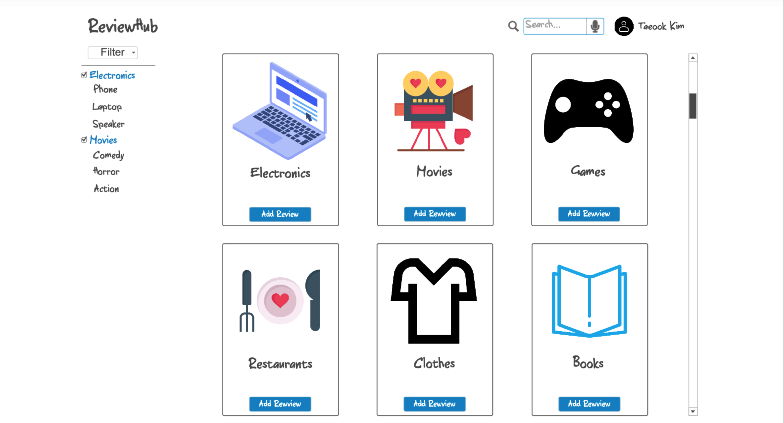
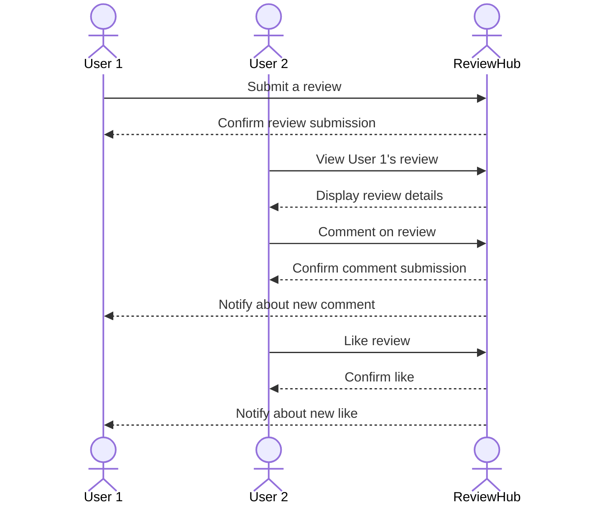

# ReviewHub

Welcome to ReviewHub, the ultimate platform for sharing and discovering reviews on everything from video games and movies to shoes and gadgets. Our mission is to create a community-driven space where users can express their opinions, find trustworthy reviews, and make informed decisions on their next purchase or entertainment choice.

## 🚀 Specification Deliverable

> [!NOTE]
>  Fill in this sections as the submission artifact for this deliverable. You can refer to this [example](https://github.com/webprogramming260/startup-example/blob/main/README.md) for inspiration.

For this deliverable I did the following. I checked the box `[x]` and added a description for things I completed.

- [x] Proper use of Markdown
- [x] A concise and compelling elevator pitch
- [x] Description of key features
- [x] Description of how you will use each technology
- [x] One or more rough sketches of your application. Images must be embedded in this file using Markdown image references.

### Elevator pitch

ReviewHub is your go-to platform for honest and comprehensive reviews on a wide range of products and entertainment. Whether you're looking for the latest insights on video games, movies, or the best shoes in the market, ReviewHub provides a community-driven space where users can share their experiences and help others make informed decisions.

### Design

The design of ReviewHub focuses on user-friendliness and accessibility, ensuring that users can easily navigate through categories, read reviews, and contribute their own insights.

### Key features

- **Comprehensive Review System**: Users can write and read reviews on a wide range of products and entertainment options.
- **User Authentication**: Secure login and registration system to ensure user privacy and data protection.
- **Real-time Updates**: Users receive real-time notifications on new reviews and comments through WebSocket integration. Additionally, leverage third-party APIs to fetch and display up-to-date information about movies and video games, ensuring users have access to the latest details and trends
- **User Profiles and Interaction**: Users can create profiles, follow other reviewers, and engage with the community through comments and likes on reviews.

### Technologies

I am going to use the required technologies in the following ways.

- **HTML**: Structure the web pages with semantic HTML elements to ensure accessibility and SEO optimization.
- **CSS**: Style the application with responsive design techniques to ensure it looks great on all devices, using animations to enhance user interaction.
- **React**: Develop a single-page application with React, utilizing components for modularity and React Router for seamless navigation between different sections like categories and user profiles.
- **Service**: Implement a backend service with endpoints for user authentication, review submission, and retrieval.
- **DB/Login**: Use a database to store user credentials, reviews, and product information securely. Implement user authentication and authorization mechanisms.
- **WebSocket**: Enable real-time updates for users by broadcasting new reviews and comments as they are submitted, enhancing the interactive experience.

## 🚀 AWS deliverable

For this deliverable I did the following. I checked the box `[x]` and added a description for things I completed.

- [ ] **Server deployed and accessible with custom domain name** - [My server link](https://yourdomainnamehere.click).

## 🚀 HTML deliverable

For this deliverable I did the following. I checked the box `[x]` and added a description for things I completed.

- [ ] **HTML pages** - I did not complete this part of the deliverable.
- [ ] **Proper HTML element usage** - I did not complete this part of the deliverable.
- [ ] **Links** - I did not complete this part of the deliverable.
- [ ] **Text** - I did not complete this part of the deliverable.
- [ ] **3rd party API placeholder** - I did not complete this part of the deliverable.
- [ ] **Images** - I did not complete this part of the deliverable.
- [ ] **Login placeholder** - I did not complete this part of the deliverable.
- [ ] **DB data placeholder** - I did not complete this part of the deliverable.
- [ ] **WebSocket placeholder** - I did not complete this part of the deliverable.

## 🚀 CSS deliverable

For this deliverable I did the following. I checked the box `[x]` and added a description for things I completed.

- [ ] **Header, footer, and main content body** - I did not complete this part of the deliverable.
- [ ] **Navigation elements** - I did not complete this part of the deliverable.
- [ ] **Responsive to window resizing** - I did not complete this part of the deliverable.
- [ ] **Application elements** - I did not complete this part of the deliverable.
- [ ] **Application text content** - I did not complete this part of the deliverable.
- [ ] **Application images** - I did not complete this part of the deliverable.

## 🚀 React part 1: Routing deliverable

For this deliverable I did the following. I checked the box `[x]` and added a description for things I completed.

- [ ] **Bundled using Vite** - I did not complete this part of the deliverable.
- [ ] **Components** - I did not complete this part of the deliverable.
- [ ] **Router** - Routing between login and voting components.

## 🚀 React part 2: Reactivity

For this deliverable I did the following. I checked the box `[x]` and added a description for things I completed.

- [ ] **All functionality implemented or mocked out** - I did not complete this part of the deliverable.
- [ ] **Hooks** - I did not complete this part of the deliverable.

## 🚀 Service deliverable

For this deliverable I did the following. I checked the box `[x]` and added a description for things I completed.

- [ ] **Node.js/Express HTTP service** - I did not complete this part of the deliverable.
- [ ] **Static middleware for frontend** - I did not complete this part of the deliverable.
- [ ] **Calls to third party endpoints** - I did not complete this part of the deliverable.
- [ ] **Backend service endpoints** - I did not complete this part of the deliverable.
- [ ] **Frontend calls service endpoints** - I did not complete this part of the deliverable.
- [ ] **Supports registration, login, logout, and restricted endpoint** - I did not complete this part of the deliverable.

## 🚀 DB deliverable

For this deliverable I did the following. I checked the box `[x]` and added a description for things I completed.

- [ ] **Stores data in MongoDB** - I did not complete this part of the deliverable.
- [ ] **Stores credentials in MongoDB** - I did not complete this part of the deliverable.

## 🚀 WebSocket deliverable

For this deliverable I did the following. I checked the box `[x]` and added a description for things I completed.

- [ ] **Backend listens for WebSocket connection** - I did not complete this part of the deliverable.
- [ ] **Frontend makes WebSocket connection** - I did not complete this part of the deliverable.
- [ ] **Data sent over WebSocket connection** - I did not complete this part of the deliverable.
- [ ] **WebSocket data displayed** - I did not complete this part of the deliverable.
- [ ] **Application is fully functional** - I did not complete this part of the deliverable.
