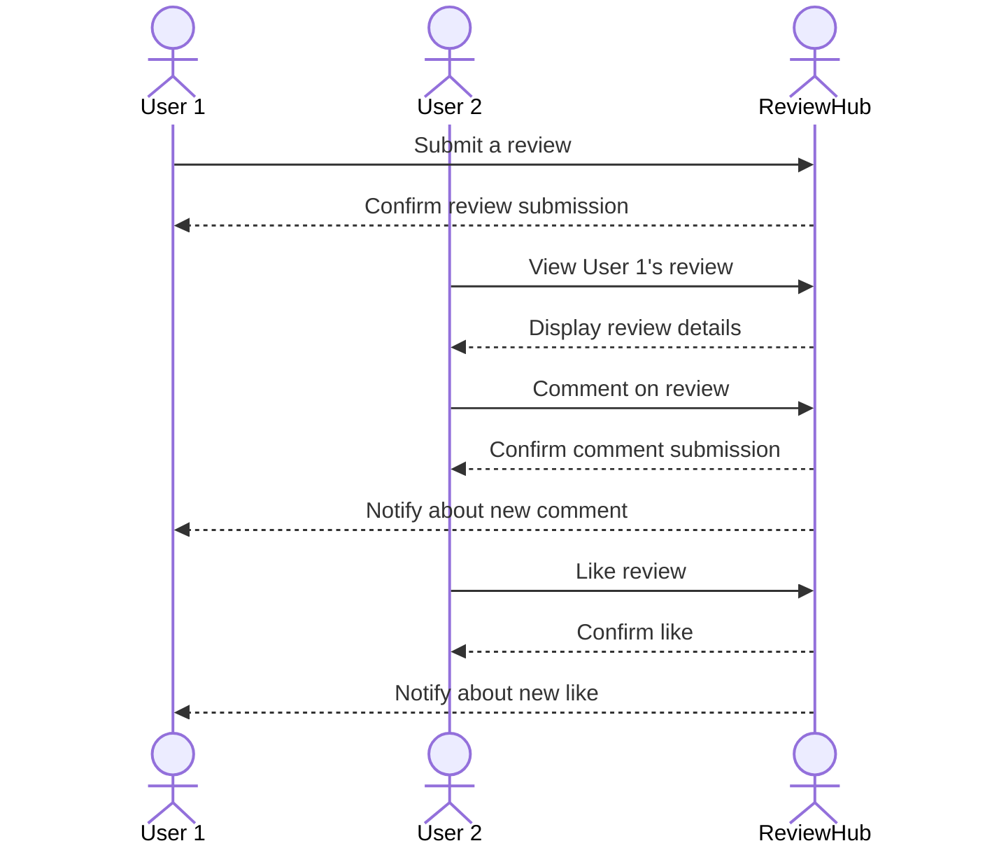

# ReviewHub

Welcome to ReviewHub, the ultimate platform for sharing and discovering reviews on everything from video games and movies to shoes and gadgets. Our mission is to create a community-driven space where users can express their opinions, find trustworthy reviews, and make informed decisions on their next purchase or entertainment choice.

## 🚀 Specification Deliverable

> [!NOTE]
>  Fill in this sections as the submission artifact for this deliverable. You can refer to this [example](https://github.com/webprogramming260/startup-example/blob/main/README.md) for inspiration.

For this deliverable I did the following. I checked the box `[x]` and added a description for things I completed.

- [x] Proper use of Markdown
- [x] A concise and compelling elevator pitch
- [x] Description of key features
- [x] Description of how you will use each technology
- [x] One or more rough sketches of your application. Images must be embedded in this file using Markdown image references.

### Elevator pitch

ReviewHub is your go-to platform for honest and comprehensive reviews on a wide range of products and entertainment. Whether you're looking for the latest insights on video games, movies, or the best shoes in the market, ReviewHub provides a community-driven space where users can share their experiences and help others make informed decisions.

### Design

The design of ReviewHub focuses on user-friendliness and accessibility, ensuring that users can easily navigate through categories, read reviews, and contribute their own insights.

### Key features

- **Comprehensive Review System**: Users can write and read reviews on a wide range of products and entertainment options.
- **User Authentication**: Secure login and registration system to ensure user privacy and data protection.
- **Real-time Updates**: Users receive real-time notifications on new reviews and comments through WebSocket integration. Additionally, leverage third-party APIs to fetch and display up-to-date information about movies and video games, ensuring users have access to the latest details and trends
- **User Profiles and Interaction**: Users can create profiles, follow other reviewers, and engage with the community through comments and likes on reviews.

### Technologies

I am going to use the required technologies in the following ways.

- **HTML**: Structure the web pages with semantic HTML elements to ensure accessibility and SEO optimization.
- **CSS**: Style the application with responsive design techniques to ensure it looks great on all devices, using animations to enhance user interaction.
- **React**: Develop a single-page application with React, utilizing components for modularity and React Router for seamless navigation between different sections like categories and user profiles.
- **Service**: Implement a backend service with endpoints for user authentication, review submission, and retrieval.
- **DB/Login**: Use a database to store user credentials, reviews, and product information securely. Implement user authentication and authorization mechanisms.
- **WebSocket**: Enable real-time updates for users by broadcasting new reviews and comments as they are submitted, enhancing the interactive experience.

## 🚀 AWS deliverable

For this deliverable I did the following. I checked the box `[x]` and added a description for things I completed.

- [x] **Server deployed and accessible with custom domain name** - [rewviewhub.link](https://rewviewhub.link).

## 🚀 HTML deliverable

For this deliverable I did the following. I checked the box `[x]` and added a description for things I completed.

- [x] **HTML pages** - Created separate HTML pages for each component of the application, including Home, Reviews(including catagories page), Profile, and About pages.
- [x] **Proper HTML element usage** - Utilized semantic HTML elements like `<header>`, `<nav>`, `<main>`, `<section>`, and `<footer>` to structure the pages effectively.
- [x] **Links** - Implemented navigation links between pages to ensure seamless user experience and easy access to different sections.
- [x] **Text** - Added descriptive text content to each page to guide users and provide context for the application's features.
- [x] **3rd party API placeholder** - Included a placeholder in the Reviews page for displaying data fetched from third-party APIs.
- [x] **Images** - Added a placeholder image on about page
- [x] **Login placeholder** - Created a login form with input fields for username and password, along with a display for the logged-in user's name.
- [x] **DB data placeholder** - Added a section in the Reviews and Profile pages to display data fetched from the database, such as user reviews and profile information.
- [x] **WebSocket placeholder** - Implemented a placeholder for real-time notifications using WebSocket in the Profile page to show dynamic updates.

## 🚀 CSS deliverable

For this deliverable I did the following. I checked the box `[x]` and added a description for things I completed.

- [x] **Header, footer, and main content body** - I used a common CSS file to style these `main.css`. The views specific things are in `about.css`, `profile.css` and `reviews.css`
- [x] **Navigation elements** - I created a navigation menu within the header, including links to Home, Reviews, Profile, and About pages.
- [x] **Responsive to window resizing** - I implemented CSS media queries to ensure the layout adjusts for smaller screens, such as stacking navigation links vertically.
- [x] **Application elements** - I added a login form and a section to display user information, along with placeholders for third-party service calls.
- [x] **Application text content** - I included descriptive text in the main content area to guide users on the features of the application.
- [x] **Application images** - I set up a section for images with hover effects to enhance user interaction in about page.

## 🚀 React part 1: Routing deliverable

For this deliverable I did the following. I checked the box `[x]` and added a description for things I completed.

- [x] **Bundled using Vite** - I used Vite to bundle the project, which provided a fast and efficient development environment with hot module replacement.
- [x] **Components** - I created reusable React components to structure the application, ensuring modularity and easier maintenance.

- [x] **Router** - I implemented React Router to manage navigation within the application, allowing for seamless transitions between different views.

## 🚀 React part 2: Reactivity

For this deliverable I did the following. I checked the box `[x]` and added a description for things I completed.

- [x] **All functionality implemented or mocked out** - The app includes all essential components and routes, with placeholders for key features like login and reviews.
- [x] **Hooks** - The app uses `useState` for state management and `useEffect` for side effects, such as fetching stored user data.

## 🚀 Service deliverable

For this deliverable I did the following. I checked the box `[x]` and added a description for things I completed.

- [x] **Node.js/Express HTTP service** - Set up a backend server with Express.
- [x] **Static middleware for frontend** - Served static files for the frontend.
- [x] **Calls to third party endpoints** - Fetched quotes and images in the About page.
- [x] **Backend service endpoints** - Created endpoints for user authentication and data retrieval.
- [x] **Frontend calls service endpoints** - Integrated frontend with backend for signup and login.
- [x] **Supports registration, login, logout, and restricted endpoint** - Implemented user authentication and access control.

## 🚀 DB deliverable

For this deliverable I did the following. I checked the box `[x]` and added a description for things I completed.

- [ ] **Stores data in MongoDB** - I did not complete this part of the deliverable.
- [ ] **Stores credentials in MongoDB** - I did not complete this part of the deliverable.

## 🚀 WebSocket deliverable

For this deliverable I did the following. I checked the box `[x]` and added a description for things I completed.

- [ ] **Backend listens for WebSocket connection** - I did not complete this part of the deliverable.
- [ ] **Frontend makes WebSocket connection** - I did not complete this part of the deliverable.
- [ ] **Data sent over WebSocket connection** - I did not complete this part of the deliverable.
- [ ] **WebSocket data displayed** - I did not complete this part of the deliverable.
- [ ] **Application is fully functional** - I did not complete this part of the deliverable.
